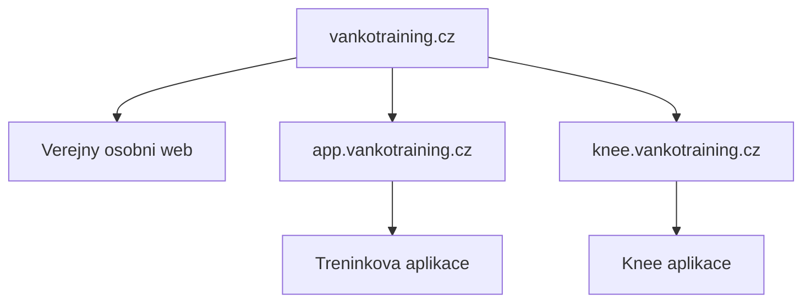

# Project Control

Ridici slozka pro projekt `knee.vankotraining.cz`.

## Aktualni rozhodnuti

- Kod knee projektu je v samostatnem repozitari `vankotraining-knee`.
- Vercel projekt bude samostatny.
- Produkcni domena bude `knee.vankotraining.cz`.
- Klientska data mohou byt ve spolecne databazi, pokud to bude davat smysl.
- Kod hlavniho webu a treninkove aplikace se s knee projektem nemicha.

## Hranice projektu

| Oblast | Patri sem | Nepatri sem |
| --- | --- | --- |
| Knee guidance | Ano | Obecny osobni web |
| Rehab framework | Ano | Marketing hlavniho webu |
| Testy kolene | Ano | Obecna databaze vsech cviku |
| Klientske profily | Jen pokud jsou potreba pro knee workflow | Plna sprava klientu |
| Programovani treninku | Jen rehab bloky pro koleno | Kompletni treninkovy builder |

## Domenu drzime takto

## Backlog

1. Pripravit Vercel projekt `vankotraining-knee`.
2. Napojit domenu `knee.vankotraining.cz`.
3. Rozhodnout, jestli knee projekt cte ze stejne Supabase databaze.
4. Navrhnout prvni workflow: vstupni triage bolesti kolene.
5. Navrhnout prvni datovy model pro guidance, testy a progres.
6. Pridat autentizaci, az bude jasne, kdo se do aplikace bude hlasit.

## Technicka poznamka

Prvni verze je jen cisty skeleton. Jakmile budeme mit potvrzeny prvni workflow,
budeme pridavat datovy model a obrazovky postupne.
