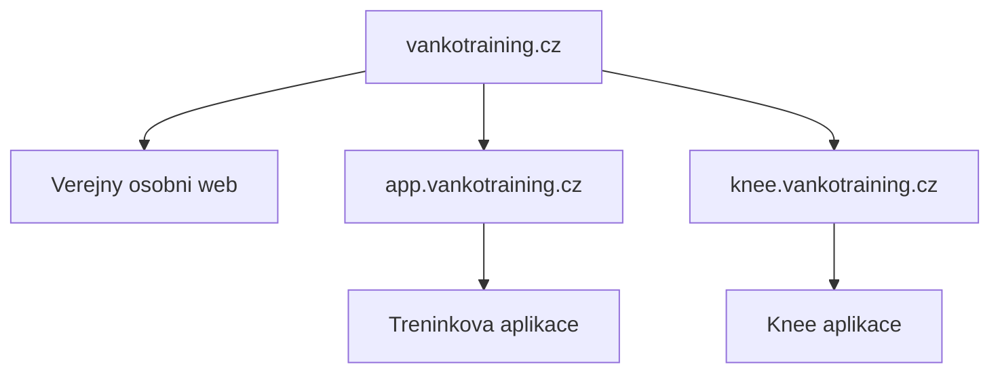

# Project Control

Ridici slozka pro projekt `knee.vankotraining.cz`.

## Aktualni faze k 2026-07-07

Faze: finalni stabilizace interniho MVP.

Aplikace je nasazena na produkcni domene a je prakticky pouzitelna pro evidenci knee extension mereni. Hlavni uzivatelske workflow je funkcni a prakticky overene. Stabilizace archivace klientu je hotova. Rucni export a zaloha dat jsou pripravene a prakticky overene. Sirsi provozni dokumentace je doplnena.

Projekt uz nema pokracovat nekonecnym vylepsovanim. Do uzavreni interniho MVP zbyvaji 3 konkretni kroky.

## Odhad dokonceni

- Interni pracovni nastroj: 97 %
- Dlouhodobe udrzovatelny produkt: 91 %
- Celkove MVP: 96 %

## Aktualni rozhodnuti

- Kod knee projektu je v samostatnem repozitari `vankotraining/vankotraining-knee`.
- Projekt je oddeleny od `vankotraining.cz` a `app.vankotraining.cz`.
- Produkcni domena je `knee.vankotraining.cz`.
- Stack je Next.js + Supabase.
- Data klientu mohou byt ve sdilene Supabase databazi, ale kod aplikaci se nemicha.
- Mazani mereni a klientu je resene jako archivace/soft delete, ne fyzicke smazani.
- Archivace a obnova jsou stabilizovane pres React stav, ne pres DOM/select.
- Vybrany klient se pro archivacni komponenty predava pres `SelectedClient` z `KneeDashboard` do `KneeApp`, ne pres DOM pozorovani.
- Aktivni cteni tabulky `athletes` je filtrovane na `deleted_at IS NULL`, aby se archivovany klient po reloadu nevracel do aktivniho seznamu.
- Vypocetni logika knee metrik je presunuta do `src/lib/knee-metrics.ts` a kryta prvnim smoke-testem.
- Rucni export/zaloha dat je resena pres Supabase SQL view `public.knee_data_export`.
- SQL pro export je ulozene v `supabase/manual-data-export.sql`.
- Provozni navod pro export je ulozeny v `project-control/manual-data-export.md`.
- Sirsi provozni dokumentace je ulozena v `project-control/operations.md`.

## Hotovo

- Supabase je napojena a data se zobrazuji.
- Prihlaseni pres Supabase funguje.
- Seznam aktivnich klientu funguje.
- Detail klienta a knee extension testy funguji.
- Pridani noveho klienta funguje.
- Pridani noveho mereni funguje.
- Editace probehleho mereni funguje.
- Archivace mereni funguje.
- Obnova archivovaneho mereni funguje.
- Archivace celeho klienta funguje.
- Obnova archivovaneho klienta funguje.
- Archivovany klient neni v aktivnim seznamu.
- Panel `Archiv klientu` je na webu a prakticky overen.
- Mobilni pouzitelnost je vyrazne lepsi nez prvni verze.
- Mobilni detail mereni ma bezpecne spodni odsazeni proti fixed tlacitku `+ Pridat mereni`.
- Graf ukazuje levou, pravou a asymetrii s moznosti skryt jednotlive serie.
- Smoke-test overuje hodnoty pro 82 kg, 33 cm, levou silu 35 kg a pravou silu 42 kg.
- Nepouzivany legacy `ButtonGuards` s DOM/MutationObserver logikou byl odstranen z kodu.
- Opraveno aktivni nacitani klientu po archivaci: GET dotazy na `athletes` automaticky doplnuji filtr `deleted_at=is.null`.
- Pripraven a prakticky overen jednoduchy rucni export dat ze Supabase vcetne aktivnich i archivovanych klientu a mereni.
- Dopsana provozni dokumentace pro stazeni CSV zalohy.
- Dopsana sirsi provozni dokumentace pro env promenne, databazi, migrace, produkcni kontrolu a incidenty.

## Prakticky overeno

- Pridani mereni funguje.
- Editace mereni funguje.
- Archivace mereni funguje.
- Obnova mereni funguje.
- Archivace klienta funguje.
- Obnova klienta funguje.
- Archivovany klient se neukazuje v aktivnim seznamu.
- Mobilni zobrazeni detailu mereni uz neni prekryte spodnim tlacitkem.
- Vypocty na testovacich hodnotach sedi: 82 kg, 33 cm, L 35 kg, P 42 kg, L 1.38 Nm/kg, P 1.66 Nm/kg, asymetrie 16.7 %, cilova sila 76.0 kg.
- Export `public.knee_data_export` vraci 106 radku, 61 klientu, 60 aktivnich klientu a 1 archivovaneho klienta.
- Export obsahuje 101 aktivnich mereni, 4 archivovana mereni a 1 radek bez mereni.
- Archivovany klient `Testovac Karel` je v exportu vedeny jako `archived` a jeho mereni jako `archived_measurement_and_archived_client`.
- Asymetrie v exportu je pocitana primo z leve/prave sily a sedi proti kontrolnimu prepoctu.

## Zbyvaji 3 kroky k uzavreni MVP

### 1. Finalni technicky uklid

- Odstranit legacy fallback anon key po potvrzeni stabilnich Vercel env promennych.
- Zkontrolovat, ze v kodu nezustava nepouzivana archivacni/DOM logika.
- Nezavadet novou funkcionalitu.

### 2. Regresni ochrana

- Rozsirit smoke-testy z vypoctu na hlavni kriticke toky:
  - vytvoreni mereni,
  - editace mereni,
  - archivace/obnova mereni,
  - archivace/obnova klienta,
  - filtr aktivnich klientu.
- Minimalni cil: mit jasny opakovatelny checklist nebo automatizovany smoke-test pro hlavni rizika.

### 3. Finalni uzavreni projektu

- Projit finalni rucni akceptacni test.
- Aktualizovat `project-control` jako uzavrene interni MVP.
- Rozhodnout, ze dalsi veci jako interpretacni karta klienta patri do v2, ne do dokonceni MVP.

## Hranice projektu

| Oblast | Patri sem | Nepatri sem |
| --- | --- | --- |
| Knee extension evidence | Ano | Obecny osobni web |
| Tindeq/knee mereni | Ano | Kompletni treninkovy builder |
| Klienti pro knee workflow | Ano | Plna CRM sprava klientu |
| Archivace a obnova knee dat | Ano | Marketing hlavniho webu |
| Graf progresu a porovnani | Ano | Obecna databaze vsech cviku |

## Domenu drzime takto

## Pravidlo pro dalsi vyvoj

Nepridavat dalsi produktove funkce do MVP. Zbyvajici prace je uzavreni, ne rozsirovani. Interpretacni karta klienta, tisk detailu nebo dalsi klinicke funkce patri do dalsi faze po uzavreni MVP.
