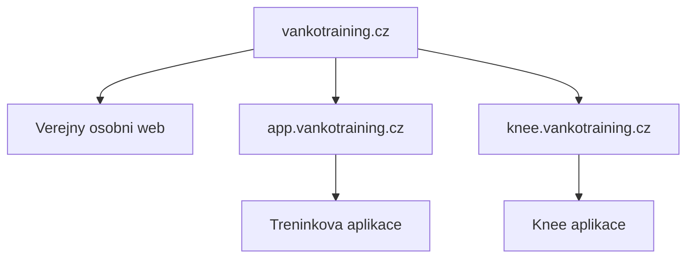

# Project Control

Ridici slozka pro projekt `knee.vankotraining.cz`.

## Aktualni stav k 2026-07-06

Projekt je ve fazi overeneho interniho MVP. Aplikace je nasazena na produkcni domene a je prakticky pouzitelna pro evidenci knee extension mereni.

Odhad dokonceni:

- Interni pracovni nastroj: 93 %
- Dlouhodobe udrzovatelny produkt: 80 %
- Celkove MVP: 92-93 %

## Aktualni rozhodnuti

- Kod knee projektu je v samostatnem repozitari `vankotraining/vankotraining-knee`.
- Projekt je oddeleny od `vankotraining.cz` a `app.vankotraining.cz`.
- Produkcni domena je `knee.vankotraining.cz`.
- Stack je Next.js + Supabase.
- Data klientu mohou byt ve sdilene Supabase databazi, ale kod aplikaci se nemicha.
- Mazani mereni a klientu je resene jako archivace/soft delete, ne fyzicke smazani.
- Vypocetni logika knee metrik je presunuta do `src/lib/knee-metrics.ts` a kryta prvnim smoke-testem.

## Hotovo

- Supabase je napojena a data se zobrazuji.
- Prihlaseni pres Supabase funguje.
- Seznam aktivnich klientu funguje.
- Detail klienta a knee extension testy funguji.
- Pridani noveho klienta funguje.
- Pridani noveho mereni funguje.
- Editace probehleho mereni funguje.
- Archivace mereni funguje.
- Obnova archivovaneho mereni funguje.
- Archivace celeho klienta funguje.
- Obnova archivovaneho klienta funguje.
- Archivovany klient neni v aktivnim seznamu.
- Panel `Archiv klientu` je na webu a prakticky overen.
- Mobilni pouzitelnost je vyrazne lepsi nez prvni verze.
- Mobilni detail mereni ma bezpecne spodni odsazeni proti fixed tlacitku `+ Pridat mereni`.
- Graf ukazuje levou, pravou a asymetrii s moznosti skryt jednotlive serie.
- Smoke-test overuje hodnoty pro 82 kg, 33 cm, levou silu 35 kg a pravou silu 42 kg.

## Prakticky overeno

- Pridani mereni funguje.
- Editace mereni funguje.
- Archivace mereni funguje.
- Obnova mereni funguje.
- Archivace klienta funguje.
- Obnova klienta funguje.
- Mobilni zobrazeni detailu mereni uz neni prekryte spodnim tlacitkem.
- Vypocty na testovacich hodnotach sedi: 82 kg, 33 cm, L 35 kg, P 42 kg, L 1.38 Nm/kg, P 1.66 Nm/kg, asymetrie 16.7 %, cilova sila 76.0 kg.

## Aktualni technicky dluh

- Cast archivace a obnovy je napojena pres samostatne pomocne komponenty kolem hlavniho dashboardu.
- `ArchivedMeasurements`, `ClientDeletion` a `ButtonGuards` pouzivaji DOM pozorovani nebo oddeleny stav misto jednotne hlavni React logiky.
- Migrace jsou historicky spoustene casto rucne pres Supabase SQL editor.
- Chybi jednoduchy export/zaloha dat.
- Chybi kratka provozni dokumentace pro obnovu, migrace a kontrolu produkce.
- Automaticke testy jsou zatim jen zakladni smoke-test vypoctu, ne UI/regresni testy cele aplikace.

## Hranice projektu

| Oblast | Patri sem | Nepatri sem |
| --- | --- | --- |
| Knee extension evidence | Ano | Obecny osobni web |
| Tindeq/knee mereni | Ano | Kompletni treninkovy builder |
| Klienti pro knee workflow | Ano | Plna CRM sprava klientu |
| Archivace a obnova knee dat | Ano | Marketing hlavniho webu |
| Graf progresu a porovnani | Ano | Obecna databaze vsech cviku |

## Domenu drzime takto

## Nejblizsi priorita

1. Stabilizovat architekturu archivace a obnovy bez zmeny chovani pro uzivatele.
2. Presunout archivaci/obnovu z pomocnych komponent do jednotnejsi React logiky.
3. Pridat jednoduchy export/zaloha dat.
4. Pridat kratkou provozni dokumentaci pro migrace, obnovu a kontrolu produkce.

## Pravidlo pro dalsi vyvoj

Nepridavat dalsi vetsi funkce, dokud nebude archivace a obnova technicky uklizena. Aplikace uz funkcne staci na praci; dalsi hodnota ted lezi ve spolehlivosti a udrzitelnosti.
